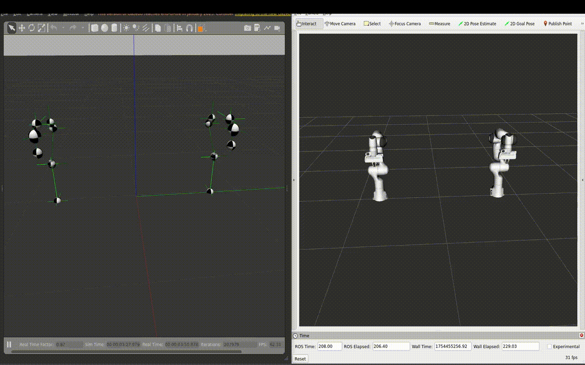
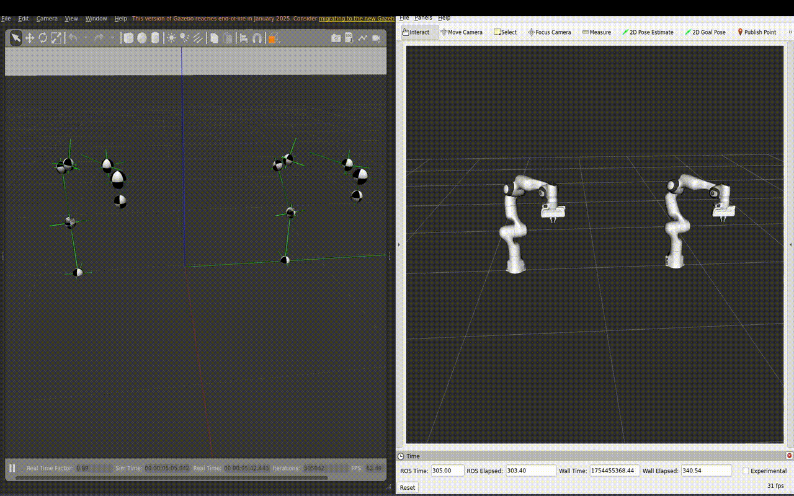
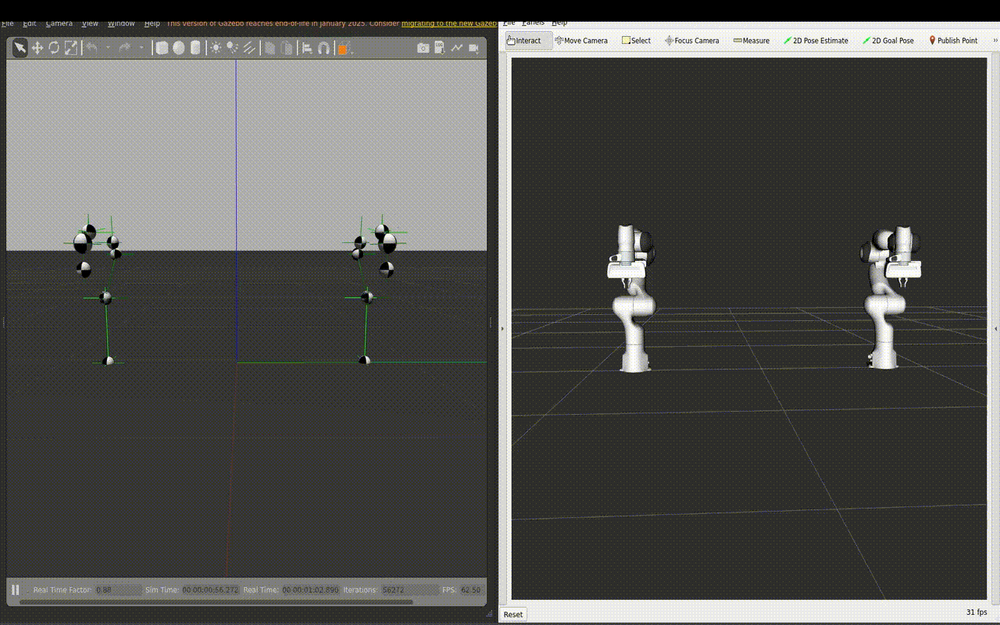
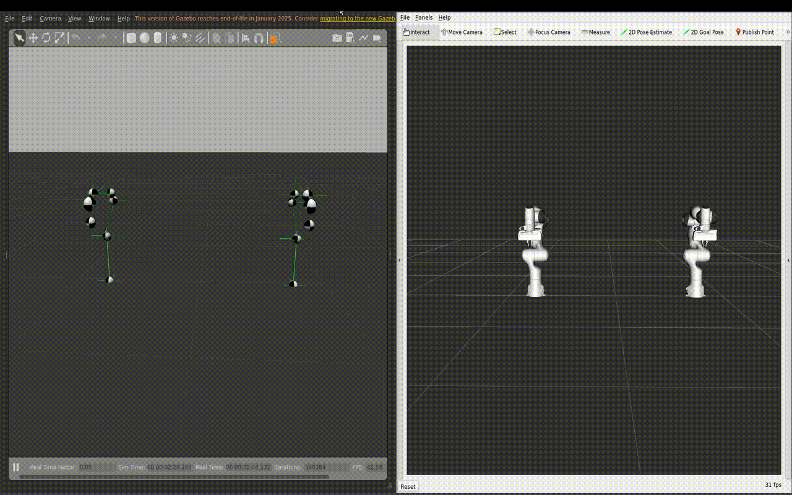
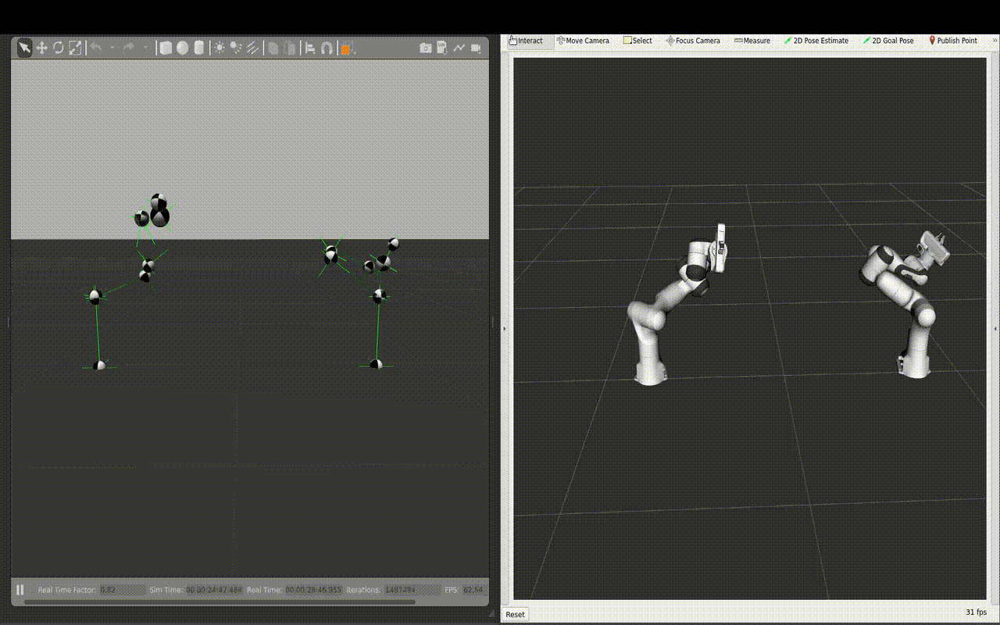
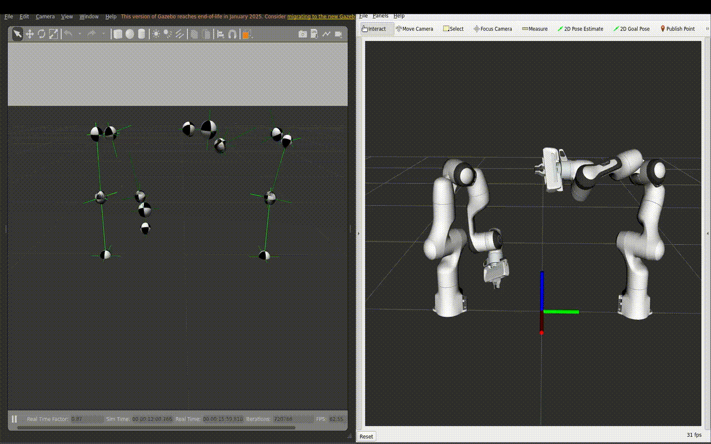

### Task 1a: Custom ROS node to publish desired joint angles to the simulated robots

### Task 1b: Publish joint angles as function of sine waves on all of the joints

### Task 2a: Move both robots synchroneously to predefined joints space configuration

### Task 2b: Move both robots synchroneously to predefined cartesian EEF poses

### Task 2c: Lift and Rotate

### Task 3: Collision

